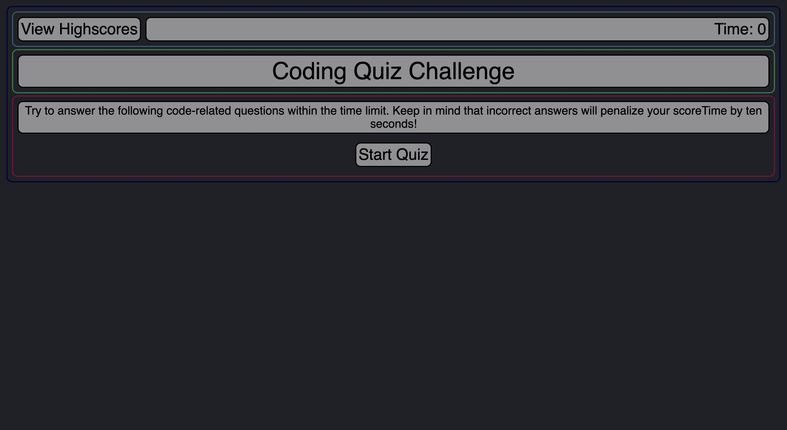
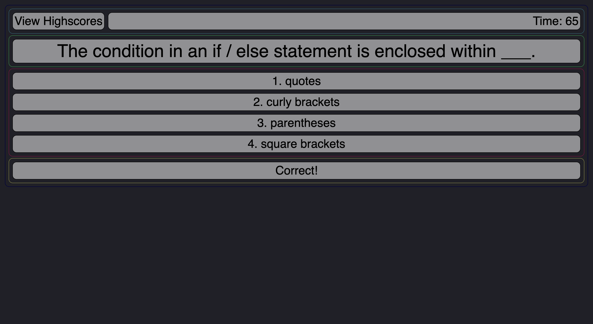

# Coding Quiz Challenge

## Project Link
https://dalto135.github.io/coding_quiz_challenge/

## Technologies
HTML, CSS and Javascript

## Description
A web application that presents an interactive Javascript quiz. The quiz is timed and time is deducted if a question is answered wrong. The quiz ends when all questions are answered or the timer runs out, and the user can store their score after typing in their initials.

## Screenshots

## License
MIT

## Contact
Dalton Wilkins - wilkins.271@osu.edu
